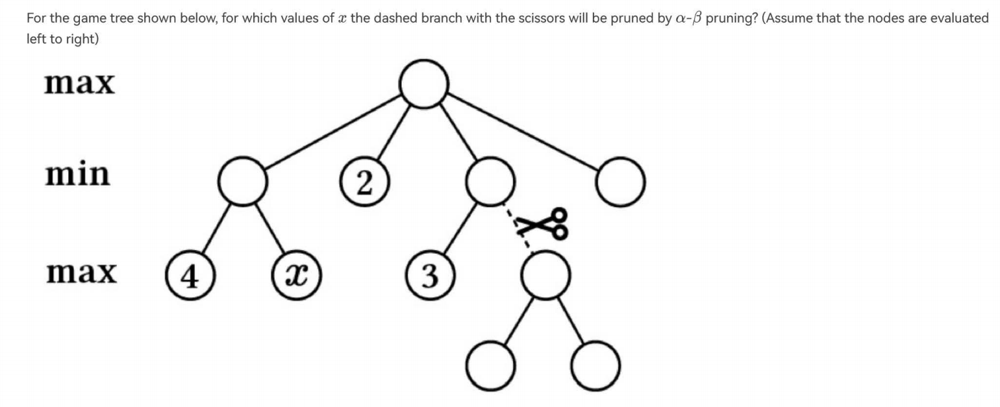
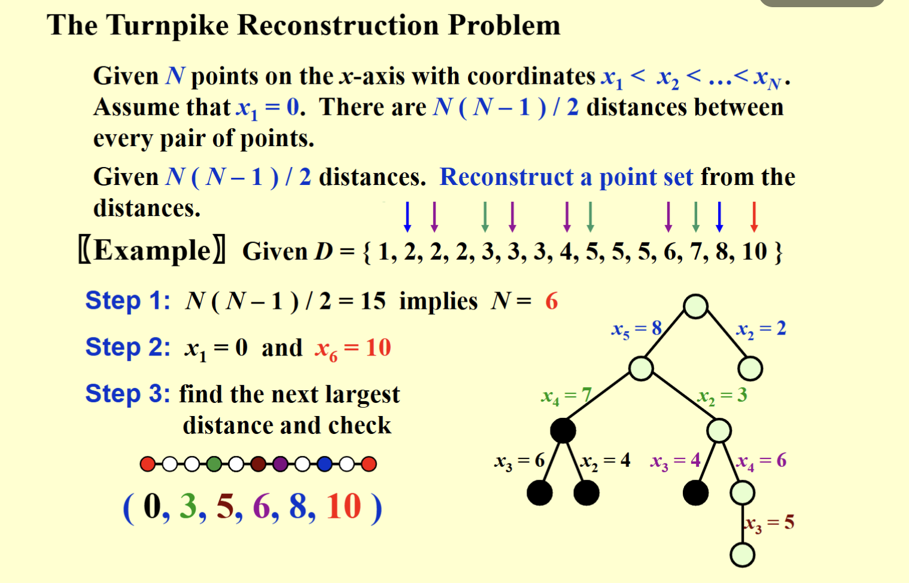
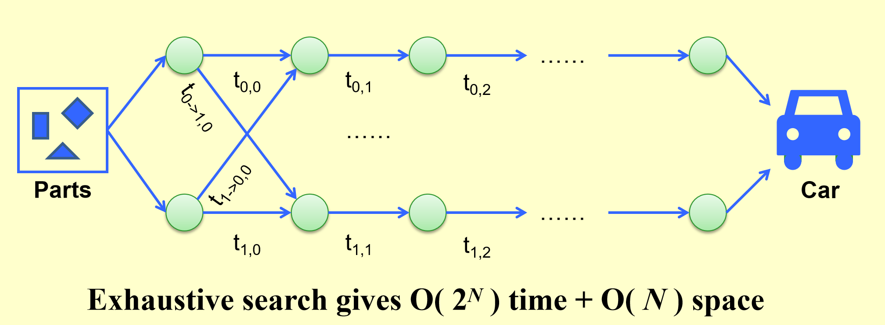
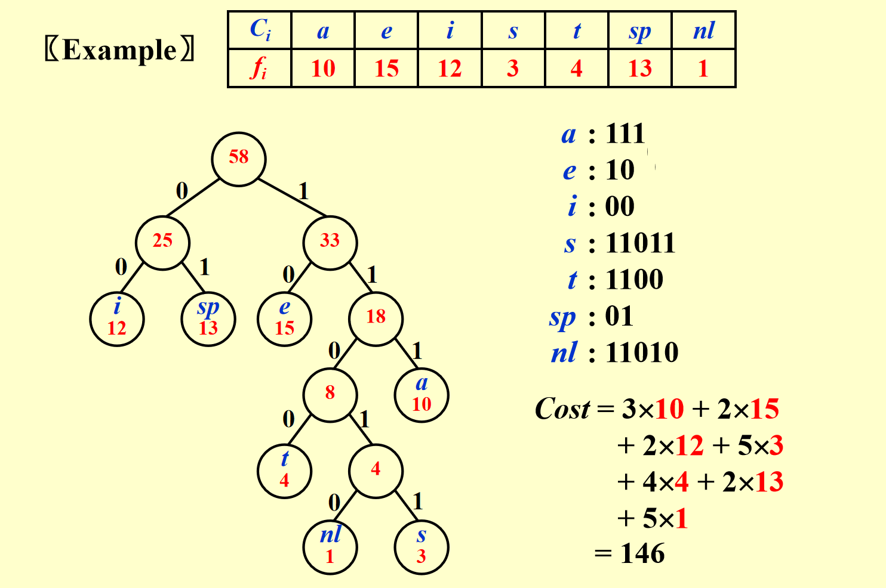
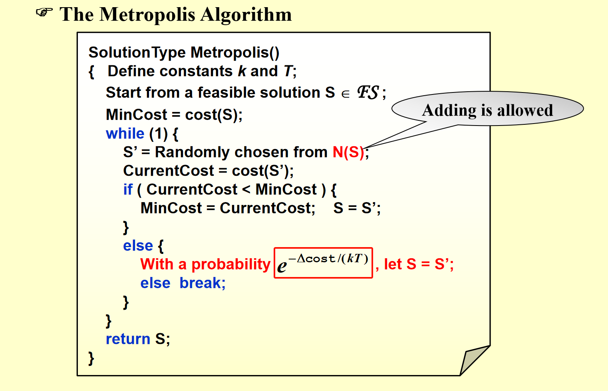

# Tips
## 回顾
- 二项队列的删除；
- 分治--主方法
- k-阶的斐波那契数


## 做题摘录

外排的缺点: It involves the use of multiple temporary files which can be time-consuming to manage.

限制距离满足三角不等式时，旅行商问题存在如下 2-近似算法:首先求出图 G 的最小生成树 T，然后在 T 上按深度优先搜索(先序遍历)的顶点遍历顺序得到一条哈密顿回路，其权重不超过最小生成树的权重的两倍。
> general不存在近似算法


- concepts of trees:
  - banary tree;
  - perfect 每层都被完全填充；
  - complete 除了最后一层都是完全填充，且最后一层为左对齐
  - full 指的是每一个节点满足要么具有2个子节点，要么不具有子节点


将N个元素插入到原始为空的二项队列当中，worst case消耗的时间为O(N).
> 注意此处指的是连续的N次插入的总时间，因此满足摊还分析下插入为O(1)的性质.

- T(n) = T($\sqrt{n}$)... 的递归深度是 O(loglogn).


The Metropolis Algorithm： 模拟退火

big-improvement-flip

Elements of DP:
- Optimal substructure
- Overlapping sub-problems

Elements of Greedy:
- there is always an optimal solution to the original problem that makes the greedy choice,
- optimal substructure 
- works only if the local optimum is equal to the global optimum
- make a choice before solving the remaining sub-problem


**Claim**: 左偏堆H1与H2经过merge得到H3,记三者的NPL分别为a,b,c则：  
c $\geq$ min(a,b) + 1   ,  c $\leq$ max(a,b) + 1;

**Claim**:对于bin packing问题，如果限定使用在线算法，其中 **最优** 的近似解法的最坏情况的近似比也为 $\frac{5}{3}$；

**Claim**: 对于收费站重建问题，如果将距离集存储在一棵 AVL 树中，且没有回溯发生，那么该算法的时间复杂度为$O(N^2\cdot\log N)$;

**Notice**: k-way的polyphase merge，对应的k-阶斐波纳契数：  
$F_N^{(k)} = F_{N-1}^{(k)} + F_{N-2}^{(k)} + \dots F_{N-k}^{(k)}$, 其中 $F_N^{(k)} = 0$ for $0\leq N \leq k-2$ 且 $F_{k-1}^{(k)} = 1$  
> 注意，此处的$F_0$不是第一项，而是第0项（不存在于最终的序列当中）；  


具有堆的性质：
- 二项堆当中的**二项树**
- 左偏堆、斜堆  

具有BST的性质：
- AVL 、Splay
- BPlus
- RBT


**主方法**的应用：
```c
strange(a1, a2, ..., an):
1. if n ≤ 2022 then return
2. strange(a1, ..., a[n/2]) 
3. strange(a[n/4 + 1], ..., a[3n/4]) 
4. for i = 1 to n: 
5.   for j = 1 to √n:
6.     print(ai + aj) 
7. strange(a[n/4 + 1], ..., a[3n/4]) 
8. strange(a[n/2 + 1], ..., an)
```
由代码可得： T(n) = 4T(2/n) + O($n^{1.5}$),根据主方法的form3可得 T(N)=$O(N^{\log_b a}) = O(N^2)$.

多项式规约通常是单向的，因为A可以规约到B意味着 A $\leq_p B$，因此反向不一定成立.


多叉的**剪枝**--分区的思想

> - 极小化层发生了prunning,是因为在极大化的父决策中这一步的结果无关紧要；  
> - 什么时候会“无关紧要”呢？也就是在极小化层的前面的值当中，存在比当前分叉已知值更大的值，这样无论后面的值什么，都不会影响极大化层的决策；  
> - 由此我们可以抽象化地描述：假设已搜索的分区为P，max/min为P中的极值，x是当前搜索的分支节点：对于极小化层的搜索，如果x中存在比$P_{max}$要小的值，后续的搜索prunning;对于极大化层的搜索，如果x中存在比$P_{min}$要大的值，x分叉中后续的值均被剪枝.


$\log{(n!)}$ = $O(n\cdot\log n)$  
AVL的摊还时间复杂度：
1. 插入：$O(\log n)$;
2. 删除：$O(1)$;


对于splay等BST的操作记住检查左小右大的合理性来 **加速** and **检验**！


### 近似比的模型
#### 列表调度
- 将n个作业分配到m个相同的核上，目标是最小化最大核的负载，采用贪心算法：每次随机选择一个未分配的作业，分配到当前负载最小的核；
- 近似比：2-$\frac{1}{m}$.


<hr>


# 整理
## AVL
基本概念：
1. 通过高度维持平衡，不一定要求左偏；
### 旋转
- 二叉树旋转的前后，中序遍历的结果保持不变；
- 注意，对于双旋的命名以第二次的方向为依据
```c
static Position DoubleRotateWithLeft(Position K3) {
    // 先右旋 touble finder 的左孩子
    K3->Left = SingleRotateWithRight(K3->Left);

    // 再左旋 trouble finder 自身
    return K3 = SingleRotateWithLeft(K3);
}
```
> 此处实际上是针对RL的情形，称为DoubleRotateWithLeft.

### Splay tree
基本概念：
1. 继承了旋转的操作，且每次操作后一定旋转该节点到 **根节点**；
2. 但是不再维护节点的平衡因子；
3. **zig=zag**的情况与AVL的双旋完全相同； **zig-zig**时，将该直线旋转改变了方向：先让中间节点旋转，然后让根节点向相同的方向旋转；

### 摊还分析
- 通常令势能函数的初值为 **0**；


## RBT
- 叶子节点指的是 **NIL**空节点；
- 在RBT当中，实际存在的节点称为内点 **internal node**, **NIL**称为外点；
- 从每个节点出发，到它后代的NIL节点的 **不同** 简单路径包含 **相同** 的黑色节点数；
- 与AVL操作的效率比较：
  - **Insertion**: 均为 <= 2;
  - **Deletion**: AVL为O($\log N$); RBT为 <= **3**;

## BPlus Tree
### M-阶的节点性质
- **root**: 没有孩子(作为leaf) / 具有 $[2,M]$ 个孩子；
- 除了root以外的 **Internal node**具有的孩子数 ： $ \lceil \frac{M}{2} \rceil$ ~ M；    
  - 因此，当整体为 $\lceil \frac{M}{2} \rceil$ 叉树时，具有最高高度，所以对于M阶B+树来说，高度为$O(\log_{\lceil \frac{M}{2} \rceil} N)$；


**claim**: 查找时间为 O(logN)；阶数M不是越大也好，最适合的是3/4；

## Leftist Heap
- **Npl**: 到外节点的最短路径长度；
  - 外节点：子节点数目少于2的节点；
- **左偏**： 任意一个节点的左子树的NPL不小于右子树的NPL；
- 右路径上有`r`个节点的左偏堆，至少具有$2^r -1$个节点；

### Skew Heap
- 是左偏堆的简单形式，不再维护NPL字段，而是每次都交换左右子树；
- 向空的斜堆中依次插入1 ~ $2^k-1$个元素之后，得到一棵 **满二叉树**；

<br>

### 堆操作的总结
| 操作        | 二叉堆        | 左偏堆      | 斜堆        | 二项堆      | 斐波那契堆  |  
|-------------|---------------|--------------|-------------|--------------|--------------|  
| Insert      | O(log n)      | O(log n)     | O(log n)    | O(1)         | O(1)         |  
| Merge       | O(n)          | O(log n)     | O(log n)    | O(log n)     | O(1)         |  
| DeleteMin   | O(log n)      | O(log n)     | O(log n)    | O(log n)     | O(log n)     |  
| Delete      | O(log n)      | O(log n)     |     | O(log n)     | O(log n)     |  
| DecreaseKey | O(log n)      | O(log n)     |    | O(log n)     | O(1)         |
> 二项队列的insert为O(1);  
> 斐波那契堆的merge, insert, decreasekey为O(1);  
> 左偏堆的操作均为$\log n$; 


<br>

## Inverted File Index
### Concepts
- 为什么我们需要倒排索引？
1. 搜索引擎对于给出的`term`，需要返回包含该`term`的`document`；
2. 通常的`index`指的是`doc`当中具体`term`的出现位置。但是我们无法直接搜索整篇`doc`，因为这样的操作时间成本太高；
3. 因此，我们给每一个`term`设置倒排索引，用来记录它们各自在整体`doc`中的分布情况.

#### Term-Document Incidence Matrix

> 1. 提取所有`doc`当中出现的所有`term`；
> 2. 建立如图所示的矩形，用`1/0`表示该`term`是否在某个`doc`当中出现，形成各自的二进制向量；
> 3. 如果要同时找出包含`A`,`B`两个`term`的`doc`索引，只需要将二者的向量作`&`运算；

<br>

- `TDIM`的方式有什么不足？
  - 可能出现较多的`0`,导致空间和时间的浪费；
  - 无法指示`term`在对应`doc`当中的出现的频率以及具体的位置；

#### Compact Version: Inverted File Index

根据前一个方法的不足，我们改进得到这样的倒排索引：  
在现在的版本，我们在`Posting List`当中记录了每个`term`的:
1. 总共出现的次数`time`（用于根据出现频率排序），如果要寻找多个`term`同时出现的`doc`，我们应该从`time`较小的`term`开始搜索，顺序检查其`Posting List`当中的`doc`是否被其他`term`所共有，这样就可以减少不必要的搜索；
2. 分别出现的位置`Documents Words`: (`docID`, `wordPos`)
   >`wordPos`应当为一个数组，因为一个`term`可能在同一个`doc`当中出现多次；

相关的概念:
> 1. `Term Dictionary`: 记录所有出现的`term`；
> 2. `Posting List`: 记录各个`term`的`times`以及`Document Words`.  
> 

<hr>

#### Index Generator

**Steps:**
1. 读取所有的文档；
2. 然后调用`Stop Filtter`对文档进行预处理，去除停用词；
3. 对于选中的`term`，调用`vocabulary scanner`扫描文档；
   >如果在`Term Dictionary`中不存在该`term`，则添加到`Term Dictionary`中；
4. 找到`term`及其`Posting List`，向其中插入新的`node`；
5. 结束之后，将倒排索引写回`disk`.
> 接下来，我们将从上述不同方面展开介绍如何设计一个`serach engine`.

<hr>

##### Read in
- `Stemming`: 将单词变为它的词干，如`running`变为`run`;
- `Stop Filtter`: 过滤掉一些无意义的词，如`the`, `and`, `a`, `an`等;

<br>

##### Access Term
- solution 1: `Search tree`
     > B+ Tree, B-Tree, Tries..
  - 性能较稳定，时间复杂度保持在`O(logN)`;
- solution 2: `Hash table`
  - 平均查找时间复杂度为O(1)，查找非常高效;
  - 但是不支持连续访问：在需要对字典序下连续访问的`term`的效率较低；

##### Deal with out-of-memory
```c
block_cnt = 0;
while ( read a doc D){
    while( read a term T){
        if( out of memory){
            // 当内存满时，将内存中的索引块写入磁盘文件 
            write block_index[block_cnt] to disk;
            block_cnt ++；
            Free last block;
        }
        if( find( dictionary, T) == false)
            insert( Dictionary, T);
        Get T's posting list;
        Insert a node into T's posting list;
    }
}
// 此时所有块都已经写入磁盘文件
for( i = 0; i < block_cnt; i++)
    // 从磁盘文件读取并合并  
    merge( inverted_index, block_index[i]);
```

<br>

### Topics
##### Distributed indexing

- `Term-partitioned index`: each node contains some terms' **complete** posting list;
  - when read in a `term`, first find its partition, then search its posting list;
- `Document-partitioned index`: each node contains some documents' inverted index;
  - when read in a `doc`, first find its partition, then search its inverted index;
- `Hybrid index`: a combination of both;

<br>

##### Dynamic indexing 
当文档数量增多时，继续向`dictionary`当中增加新的`term`节点的成本较高，需要引入辅助空间存储`new doc`的倒排索引；
- `main Index`：存储先前的`doc`的倒排索引（占大部分）；
- `auxiliary Index`：存储新增的`doc`的倒排索引；

1. 当我们`access`一个`term`时，首先在`main Index`中查找，如果没有找到，则在`auxiliary Index`中查找；
2. 当`insert`1个新的`term`时，优先记录到辅助索引`auxiliary Index`中.
3. 当辅助空间当中的数量达到一定阈值时，与`main Index`合并，并清空辅助索引；

##### Compression

1. 一方面，将`dictionary`的`term`条目写在一个数组里，同时用另一个辅助数组记录各个`term`开始的`index`，从而压缩了`dictionary`的储存空间；  
2. 另一方面，为了避免`posting list`中倒排索引的大小溢出，用相邻位置的索引差来代替原来的倒排索引，使得整体的值保持在较小的范围；

<br>

##### Thresholding 阈值
**doc**方面：计算各个`doc`的`weight`重要性并据此排序，仅处理`top x`文档
- disadvantage:
  - 无法处理`boolean query`，即之前所说的利用`&`运算快速得到包含共有`term`的`index`；
  - 将`miss`相关的部分文档
 
**query**方面：将给出的`term`按照`frequency`增序排序，仅处理`top x`的`term`
> 出现频率较低的`term`具有更高的参考价值；


设定一个阈值`x`,将全部的`term`排序之后，取部分的`term`进行一次搜索，然后取增量$\Delta x$再次搜索，如果两次相差不大，则完成搜索；如果相差较大，继续增大`x`.

### Measure
1. 建立倒排索引的速度： number of docs per hour
2. `search`的速度：比较需要等待的延时；
    >注意到，由于`index`所用的`doc`数目可能不同，不同规模的`docs`也会影响`search`的时间。因此需要用 ***function of index size***来比较不同的搜索引擎性能。
3. Expressiveness of query language：
   1. 是否能够处理复杂的查询；
   > 比如简单的`&`逻辑之外，是否支持类似于`apple-company`来搜索真实苹果的搜索？ 
   2. 对于复杂`query`的处理速度；
4. User happiness：
   1. Data: response time & index space;
   2. how relevant the answer set is.

#### Relevance
***precision*** P = R<sub>R</sub> / (R<sub>R</sub> + I<sub>R</sub>);  关注返回中的相关率  
***recall*** R = R<sub>R</sub> / (R<sub>R</sub> + R<sub>N</sub>);   关注所有相关的返回比率


## Binomial Queue
### Concepts
什么是二项队列？二项队列是一系列二项树的集合。因此首先需要认识 **二项树**.

- ***binomial tree***
  - 满足堆的性质；
  - k阶二项树用 $B_k$ 表示；
  - $B_k$由$B_{k-1}$作为另一个$B_{k-1}$的孩子直接得到 => 二项树的根节点的孩子都是一棵二项树；
  - 定义$B_0$为只含一个`root`的树；
  - 进一步的性质：
    - $B_k$的根有**k**个孩子（即0~k-1阶的二项树），包含自身共2<sup>k</sup>个节点；
    - $B_k$的第d层具有$\binom{k}{d}$个节点；
    - 由于二项树是N叉树，需要我们用左孩子右兄弟的方式来表示其结构.
>**左孩子-右兄弟**的构造：
>1. 将原树中每一个节点的第一个子节点作为自身的左子节点；
>2. 该节点的第一个**兄弟**作为自己的**右子节点**
>3. 递归进行上述操作

- ***bimonial queue***
  - 二项队列是二项树的集合；
  - 二项队列包含任何阶数的二项树的个数为： **0/1**;
  - 二项队列可能具有一个指向最小节点的指针`min`，也可能不存在，根据题目的意思来判断.

根据上述性质，如果二项队列的节点个数为`N`，可以将其转化为二进制的形式，对应阶数k的`0/1`表示$B_k$是否存在.
> 13 = ${(1101)}_2$, 因此可以用0,2,3阶二项树来组成这个二项队列.

<br>

### Operations
>均以最小堆为优先队列说明.
- 结构体：
```c
typedef struct Binomial_node{
    ElementType key;
    Binomial_node* left_child;
    Binomial_node* right_sibling;
}Binomial_node;

typedef struct Binomial_queue{
    int size; // the number of the elements in the queue
    Binomial_node* trees[MaxTrees];
}Binomial_queue;
```

#### Find_min
由性质可知，最小节点一定是众多二项树当中的一个根节点，因此只需要找到这个根节点即可.   


如果二项队列不存在指向最小元素的指针，则需要遍历整个二项队列，找到最小的根节点.在这个条件下，我们继续分析`Find_min`操作的时间复杂度上界：  
给定节点个数`N`，求遍历二项队列的时间复杂度上界。由于每次我们只需要访问二项树的根节点，所以求解时间复杂度等价于求解二项树的个数。将`N`转化为二进制的向量，其中`1`的个数就是二项树的个数。换言之，我们的求解可以继续转化为：
<center> 给定N,求解最多其二进制表示下最多的`1`的个数.</center>  

假设二进制表示下`1`的个数为 **x**, 当这些`1`均从低位向高位填充时，得到此时最小的`N`,即$2^x-1 \leq N$. 转换得到 $x \leq \log_2 N$. 因此，`Find_min`的时间复杂度上界为$O(\log N)$.

#### Merge
- 时间复杂度：在保证队列当中的二项树是 ***sort by height*** 的情况下，为$O(\log N)$；
- 实现思路：
  - 将两个二项队列合并，相当于做二进制的加法，发生进位等价于二项树的合并，进位意味着更高阶二项树的产生；
  - 因此，我们首先需要完成基本的“进位”操作，即`Combine_trees`函数，将两个二项树合并为一个.
```c
Binomial_node* CombineTrees(Binomial_node* T1, Binomial_node* T2){
    //based on the small-size heap
    //compare the keys of the two trees and make sure T1 has the smaller one
    if(T1->key > T2->key)
        return CombineTrees(T2,T1);
    
    //to avoid the lose the pointer of the left child of T1
    T2->right_sibling = T1->left_child;
    T1->left_child = T2;
    return T1;
}
```
>根据左孩子-右兄弟可以想象，每个`root`一定具有`left_child`且没有`right_sibling`。将同阶的二项树`T2`作为`T1`的`child`时，`T2`的`root`具有了自己兄弟，因此将`T2`的`right_sibling`指向`T1`的`left_child`，然后更新`T1`的`left_child`为`T2`.

---

```c
Binomial_queue* Merge(Binomial_queue* H1, Binomial_queue* H2){
    Binomial_node* T1, *T2, *carry;
    T1 = T2 = carry = NULL;
    int i,j;
    //avoid overflow of the trees array
    if(H1->size + H2 -> size > MaxTrees){
        printf("Error: the size of the merged queue is too large!\n");
        return NULL;
    }
    H1->size += H2->size; //update the size of the merged queue
    //and focus: H1 is the final queue we get

    //merge queues like a full adder
    for(i = 0, j = 1; j <= H1->size; i++, j *= 2){
        T1 = H1->trees[i];
        T2 = H2->trees[i];
        switch(4*!!carry + 2*!!T2 + 1*!!T1){
            case 0://000 means nothing to do
                break;
            case 1://001 since T1 is from H1, we keep it and do nothing
                break;
            case 2://010 means H2 has a tree which needs to be added to H1
                H1->trees[i] = T2;
                H2->trees[i] = NULL;
                break;
            case 3://011 means we should combine T1 and T2
                carry = CombineTrees(T1,T2);
                H1->trees[i] = H2->trees[i] = NULL;
                break;
            case 4://100 means H1 should add the carry to its current treeNode
                H1->trees[i] = carry;
                carry = NULL;
                break;
            case 5:// 101 means we should combine the T1 and the carry, and then let it be the new carry
                carry = CombineTrees(carry,T1);
                H1->trees[i] = NULL;
                break;
            case 6://110 means we should combine the T2 and the carry, and then let it be the new carry
                carry = CombineTrees(carry, T2);
                H2->trees[i] = NULL;
                break;
            case 7://111 means we should keep the carry, and combine T1 and T2;
                H1->trees[i] = carry;
                carry = CombineTrees(T1, T2);
                H2->trees[i] = NULL;
                break;
        }
    }
    return H1;
} 
```
1. `Binomial_node*`类型的指针`T1`和`T2`等经过两次`!`的计算，从指针类型转化为了逻辑值，用来表示是否存在对应的二项树；
2. 注意最终要得到的队列是`H1`，因此当加法器中的`1`仅来自于`H2`时，也要将其合并到`H1`当中；如果仅来自于`H1`就不需要操作；
3. `011`则调用`Combine_trees`函数合并`T1`和`T2`，并将结果赋给`carry`；
4. 利用`j`从`1`开始，每次执行左移一位，从而约束了执行的时间。假设`H1`最终结果的二进制是`1xxxx`，那么`j`相当于一个不断左移的指针，最后一步操作一定是`j`指向`H1`当中最左侧的`1`。然后跳出循环。这是合理的，因为不可能存在更多的二项树需要继续合并。

---

#### Insert
> 看作特殊的`merge`即可；
- 时间复杂度： 摊还下单次插入为 **O(1)**；
- claim:

#### Delete_min
```c
Binomial_queue* DeleteMin(Binomial_queue* H){
    Binomial_queue* DeletedQueue;
    Binomial_node* DeletedTree, *oldRoot;
    ElementType min_key = INFINITY;
    int min_tree = -1;
    if(H->size == 0){
        printf("The queue is empty!\n");
        return NULL;
    }

    //step1:寻找最小值所在的树
    for(int i=0 ; i < MaxTrees; i++){ // 注意检查是否存在tree
        if(H->trees[i] && H->trees[i]->key < min_key){
            min_key = H->trees[i]->key;
            min_tree = i;
        }
    }

    //step2:将min_tree从H中移除，得到H’
    DeletedTree = H->trees[min_tree];
    H->trees[min_tree] = NULL;
    oldRoot = DeletedTree;
    DeletedTree = DeletedTree->left_child;
    free(oldRoot);

    //初始化H''并将子树并入其中
    DeletedQueue->size = (1<<min_tree) - 1;//利用阶数计算size
    for(int j = min_tree-1; j>=0;  j-1){
        DeletedQueue->trees[j] = DeletedTree;
        DeletedTree = DeletedTree->right_sibling;
        DeletedQueue->trees[j]->right_sibling = NULL;
    }

    H->size -= DeletedQueue->size + 1;
    H = Merge(H, DeletedQueue);
    return H;
}
```
1. 由于k阶的二项树除去其root之后，得到了0~k-1阶的二项树的集合，我们将其看作新产生的二项队列`DeletedQueue`（需要初始化），以便于之后直接调用`Merge`函数合并到原队列`H`中；
2. 最后循环构建得到`DeletedQueue`的循环需要特别注意；
3. 由于`merge`中包含了`size`的更新，因此需要先将`H`的`size`减去`DeletedQueue`的`size`再加`1`；


### Analysis
**claim**：   
-  A binomial queue of N elements can be built by Nsuccessive insertions in **O(N)** time.

<br>

聚合法证明：
  - 每次插入需要构建新的`node` --- cost = 1;
  - 每隔4,8,16...次插入，分别需要1,2,3...进位；
  - 由于插入N次，将上述的进位代价平均到每次的插入当中，得到：
<center>N($\frac{1}{4}+\frac{1}{8}\cdot2+\frac{1}{16}\cdot3+\cdots+\frac{1}{2^{k+1}}\cdot k$) = N , when k->$\infty$ </center>

> 因此，整体的时间复杂度为 O(N), 除以N得到单次插入的摊还复杂度：**O(1)**.

<br>

势能法证明：


Let:
- $C_i$ := cost of the $i_{th}$ insertion
- $Φ_i$ := number of trees after the $i$th insertion $(Φ_0 = 0)$

For each insertion $i = 1, 2, ..., N$:
- Actual cost $(C_i)$ plus change in potential $(Φ_i - Φ_{i-1})$ = 2
- $C_i + (Φ_i - Φ_{i-1}) = 2$

Sum up all N equations:
$\sum_{i=1}^N C_i + Φ_N - Φ_0 = 2N$

Therefore:
$\sum_{i=1}^N C_i = 2N - Φ_N ≤ 2N = O(N)$

While $T_{worst} = O(\log N)$, the amortized time $T_{amortized} = 2$

<hr>

## Backtracking
回溯类问题的函数模板：
```c
bool Backtracking ( int i){
    Found = false;
    if( i > N)
        return true;
    for(each xi in Si){
        //check if satisfies the constraint
        OK = Check(...,R); //prunning 
        if(OK){
            Count xi in;
            Found = Backtracking(i+1);
            if(!Found)
                Undo(i)l //recover 
        }
        if(Found) break;
    }
    return Found;
}
```

### 回溯类典型问题
#### 八皇后问题
- 约束条件：
  - 可选集合Si = {1,2,..N};
  - (xi - xj)/(i-j) $\neq$ $\pm1$ 
#### 收费站问题
>The Turnpike Reconstruction Problem


1. 初始化$x_0$与$X_N$
2. 从右往左（距离从大到小）尝试放置$X_i$
	1. 首先放置在右侧，检查距离集合是否满足要求，满足则标记相关的距离为`-1`
	2. 如果第一步无解，考虑将$X_I$放置在对称位置，继续检查
3. 如果$X_i$的两个位置均无解，退回（操作还原：距离恢复，即当前栈的`max_dist`）

**伪代码实现**
```c
bool Reconstruct ( DistType X[ ], DistSet D, int N, int left, int right )
{ /* X[1]...X[left-1] and X[right+1]...X[N] are solved */
    bool Found = false;
    if ( Is_Empty( D ) )
        return true; /* solved */
    D_max = Find_Max( D );
    /* option 1：X[right] = D_max */
    /* check if |D_max-X[i]|D is true for all X[i]’s that have been solved */
    OK = Check( D_max, N, left, right ); /* pruning */
    if ( OK ) { /* add X[right] and update D */
        X[right] = D_max;
        for ( i=1; i<left; i++ )  Delete( |X[right]-X[i]|, D);
        for ( i=right+1; i<=N; i++ )  Delete( |X[right]-X[i]|, D);
        Found = Reconstruct ( X, D, N, left, right-1 );
        if ( !Found ) { /* if does not work, undo */
            for ( i=1; i<left; i++ )  Insert( |X[right]-X[i]|, D);
            for ( i=right+1; i<=N; i++ )  Insert( |X[right]-X[i]|, D);
        }
    }
    /* finish checking option 1 */
    if ( !Found ) { /* if option 1 does not work */
        /* option 2: X[left] = X[N]-D_max */
        OK = Check( X[N]-D_max, N, left, right );
        if ( OK ) {
            X[left] = X[N] – D_max;
            for ( i=1; i<left; i++ )  Delete( |X[left]-X[i]|, D);
            for ( i=right+1; i<=N; i++ )  Delete( |X[left]-X[i]|, D);
            Found = Reconstruct (X, D, N, left+1, right );
            if ( !Found ) {
                for ( i=1; i<left; i++ ) Insert( |X[left]-X[i]|, D);
                for ( i=right+1; i<=N; i++ ) Insert( |X[left]-X[i]|, D);
            }
        }
        /* finish checking option 2 */
    } /* finish checking all the options */
    
    return Found;
}

```

<br>

**claim**:
- 如果将距离集存储在一棵 AVL 树中，且没有回溯发生，那么该算法的时间复杂度为$O(N^2\cdot\log N)$;
#### Min_max strategy
定义效用函数： “goodness”
f(P) = W1-W2
> 其中W为展开到叶子后，对应的个数

##### Alpha-Beta 剪枝
- 目的： 用于优化极大极小化算法
- 思路：
  - α prunning： 需要极大化当前层的数据；
  - β prunning： 需要极小化当前层的数据；
  - 

- 结论： when both techniques are combined.In practice, it limits the searching to only O($\sqrt{N}$)nodes, where N is the size of the full game tree.

<hr>


## Divide & Conquer 分治法
>将一个问题分解为若干个规模较小的相同问题，然后递归地解决这些子问题，最后将这些子问题的解合并得到原问题的解.

<center>  T(N) = $aT(\frac{N}{b}) +  f(N))$ </center>


### Closet Points Problem
二维最近点问题: 给定平面上的 n 个点，找出其中距离最近的两个点.

- 朴素的解决思路： 通过O($N^2$)的时间复杂度枚举所有的可能，找出距离最近的两个点.
- 分治法： 
  - 每次将平面分为两个区域，分别寻找子区间内最近的距离，记二者当中的较小值为`min`;
  - 接下来需要在距离中线`min`范围内查询是否存在距离小于`min`的点；

```c
// points are in the strip
// and sorted by y coordinates
for (i = 0; i < NumPointsInStrip; i++)
    for (j = i + 1; j < NumPointsInStrip; j++)
        if (Dist_y(Pi, Pj) > delta)
            break;
        else if (Dist(Pi, Pj) < delta)
            delta = Dist(Pi, Pj);
```
> 通过y轴约束距离，最多查找一个点的7个邻域；


### 复杂度分析
#### 代换法
>大胆猜测，小心验证.

如果出现类似于$T(\sqrt{N})$的形式：
- 令$m = \log n$,则$T(\sqrt{N})$ = $T(2^{\frac{m}{2}})$; $T(n) = T(2^m)$;
- 再令$S(m)= T(2^m)$, $S(\frac{m}{2}) = T(2^\frac{m}{2})$；
- 由此转化为了一般形式.


#### 递归树法
1. `a`影响了叶子的个数；`b`影响展开的层数；
2. e.g. 

#### 主方法
>参见笔记

>迭代法求解含根号的复杂度方程.

<hr>

## Dynamic Programming
>Solve sub-problems just once and save answers in a table
### 典型模型
#### Fibonacci Numbers
```c
int  Fibonacci ( int N ) 
{   int  i, Last, NextToLast, Answer; 
    if ( N <= 1 )  return  1; 
    Last = NextToLast = 1;    /* F(0) = F(1) = 1 */
    for ( i = 2; i <= N; i++ ) { 
        Answer = Last + NextToLast;   /* F(i) = F(i-1) + F(i-2) */
        NextToLast = Last; Last = Answer;  /* update F(i-1) and F(i-2) */
    }  /* end-for */
    return  Answer; 
}
```
> T(N) = O(N)

#### Ordering Matrix Multiplications
- 矩阵的计算需要满足 左列 = 右行；
- 满足约束可能会有不同的计算顺序，我们的目标是寻找一个合适的矩阵乘法顺序，使其计算的步骤最少；

```c
/* r contains number of columns for each of the N matrices */ 
/* r[ 0 ] is the number of rows in matrix 1 */ 
/* Minimum number of multiplications is left in M[ 1 ][ N ] */ 
void OptMatrix( const long r[ ], int N, TwoDimArray M ) 
{   int  i, j, k, L; 
    long  ThisM; 
    for( i = 1; i <= N; i++ )   M[ i ][ i ] = 0; 
    for( k = 1; k < N; k++ ) /* k = j - i */ 
        for( i = 1; i <= N - k; i++ ) { /* For each position */ 
	j = i + k;    M[ i ][ j ] = Infinity; 
	for( L = i; L < j; L++ ) { 
	    ThisM = M[ i ][ L ] + M[ L + 1 ][ j ] 
		    + r[ i - 1 ] * r[ L ] * r[ j ]; 
	    if ( ThisM < M[ i ][ j ] )  /* Update min */ 
		M[ i ][ j ] = ThisM; 
	}  /* end for-L */
        }  /* end for-Left */
}
```
> T(N) = O($N^3$)

#### Optimal Binary Search Tree

- 目标： 给出`N`个`word`，各自的搜索概率是$p_i$. 寻找一个最合适的二叉树结构，使得整体的搜索时间最少，即：
<center> T(N) = $\sum_{i=1}^N p_i \cdot (1+d_i)$极小化，其中$d_i$为树中第`i`个节点的深度. </center>

- **构建**：
  1. 初始化将各个分区的长度设置为1，`pro`就是该`term`的本身；
  2. 计算`A...B`的最优解，指的是我们需要从中选取一个节点`C`作为根节点；
     1. 此时，`c`将原本的序列分为了左右两部分；
     2. 由于`DP`的性质，我们已经在之前计算过子序列的最优解；
     3. 因此，只需要遍历`c`的选择，使得这两个子序列的和最小，得到此时的最优结构；
  3. 计算：
     1. 由于除了`root`的`c`，其余节点的`depth`均为`++`；
     2. 因此，最终的权值，就是所有节点的`weight`求和 + `2.4`得到的、两个子序列的和.

- **construct**
  > 如果根据`构建`的结果反向得出此时的结构呢？
1. 从最终的一个序列开始，提取`root`，得到了左右两个子序列；
2. 整体的结构中，`root`就是`opt`的根，且子序列的`root`就是其孩子，且可以从先前的结构中得到；
3. 重复步骤`1`，反复提取子序列的`root`，并不断划分；

#### All-pairs Shortest Path
- 给定一个图`G=(V,E)`, 其中`V`为节点集合，`E`为边集合，边的权值为`w(u,v)`；
- 目标： 计算`G`中任意两点间的最短路径；

**朴素的解决**：用每次耗时O($N^2$)的单源最短路径算法，遍历N个节点，可以得到所有节点对之间的最短路径。  

**DP思路**：
1. 二维数组`D`记录两个点之间的最短路径长度，即结果数组；
2. 初始化时，先将`D`用边的数组的值填充（自身设置为`0`），其他值设置为无穷大；
3. 遍历`N`个节点：每次遍历所有点对，计算经过最外层这个固定点的距离之和是否小于`D`中记录的最短路径长度；
   1. `yes`: 更新`D`;
   2. `no`: 保留不变；

```c
/* A[] contains the adjacency matrix with A[ i 1[ i ] = 0 */
/* D[] contains the values of the shortest path */
/* N is the number of vertices */
/* A negative cycle exists iff D[ i ][ i ] < 0 */
void AllPairs( TwoDimArray A, TwoDimArray D, int N ){
    int i, j, k;
    for (i = 0; i< N; i++) /* Initialize D */
        for(j = 0; j< N; j++ )
            D[i][j]=A[i][j];
    for( k = 0; k < N; k++ ) /* add one vertex k into the path */
        for( i = 0; i < N; i++ )
            for(j = 0; j< N; j++ )
                if(D[i][k]+D[k][j]<D[i][j])
                /* Update shortest path */
                D[i][j]=D[i][k]+D[k][j];
    }

```

#### Product Assembly
问题的情景：
- 有两条生产线来组装一辆汽车；
- 一共需要经历`N`个`stage`组装完成，每次组装消耗一定时间，且每次`stage`可以选择移动到任意一条生产线；
- 不同`stage`以及生产线`line`之间的组装耗时不同；
- 题目要求，给定`stage`以及`line`的耗时信息，求解最短的组装时间以及执行的`line`序列；


```c
f[0][0]=0; L[0][0]=0;
f[1][0]=0; L[1][0]=0;
for(stage=1; stage<=n; stage++){
  for(line=0; line<=1; line++){
    f_stay = f[  line][stage-1] + t_process[  line][stage-1];
    f_move = f[1-line][stage-1] + t_transit[1-line][stage-1];
    if (f_stay < f_move){
      f[line][stage] = f_stay;
      L[line][stage] = line; //stay on the same line
    }
    else {
      f[line][stage] = f_move;
      L[line][stage] = 1-line; //move to the other line
    }
  }
}

//reconstruct the solution
line = f[0][n]<f[1][n]?0:1;
for(stage=n; stage>0; stage--){
  plan[stage] = line;
  line = L[line][stage];
}

```

### DP的设计思路
1. 得到最优解的计算方法（递推公式）；
2. 以固定的顺序，递归计算最优解并填入`table`；
3. `reconstruct`解决策略得到输出.

<hr>

## Greedy Algorithms
**贪心算法**： 每个决策阶段都选择当前看起来最优的解决方案，从而希望能够达到全局最优解
> 核心思想是局部最优选择，通过一系列局部最优的选择，来达到全局最优的目标。

### Activity Selection Problem
- 问题抽象：
  - 给定若干个区间，包含开始与结束的时间点；
  - 给定一个总时间段，求解最多能够在这个时间段上放置多少个区间

- 最优贪心策略：
  - 每次选择结束时间最早的区间

### Huffman Coding
每个节点具有属性`weight`，我们希望构造一棵二叉树，使得树的权值最小。

```c
void Huffman ( PriorityQueue  heap[ ],  int  C )
{   consider the C characters as C single node binary trees,
     and initialize them into a min heap;
     for ( i = 1; i < C; i++ ) { 
        create a new node;
        /* be greedy here */
        delete root from min heap and attach it to left_child of node;
        delete root from min heap and attach it to right_child of node;
        weight of node = sum of weights of its children;
        /* weight of a tree = sum of the frequencies of its leaves */
        insert node into min heap;
   }
}
```
> 1. 每次构建一个`new node`时，从堆中提取两个最小的节点，分别放在左右子树，可见满足BST性质；
> 2. 计算`cost`时，将编码字长 x 频率然后累加得到；
> 3. 时间复杂度：O($C\log C$)

e.g.

## NP Complete Problems
### Basic Concepts
**NP问题** -- Nondeterministic polynomial-time
1. 非确定性图灵机可以用多项式时间的算法解决 的问题称为~；
2. 意味着用确定性图灵机可以用多项式时间的算法来**验证**;
> 非确定性图灵机指的是：图灵机有无限的并行”纸带“，使得如果对于存在正确路径的k条路径，可以立即得到正确的答案；而确定性图灵机只能通过遍历寻找正确路径；
> 对于不可判断类型的问题，非确定性图灵机也无法得出答案；

**Decidable Problems** : 可判定问题
> 指的是那些可以通过算法在有限时间内解决的问题;
> 停机问题 **Halting Problem** 属于典型的不可计算问题；

**NPC问题**
1. 本身是 **NP**问题（解可以在多项式时间内验证）；
2. NP类中的其他问题**都**可以在**多项式时间内规约**到它；
   1. 将一个问题用多项式时间转换为另一个问题
> 如果我们找到了解决某个NP完全问题的多项式时间算法，那么所有NP问题都可以用同样的方法在多项式时间内解决，这将意味着 ***P = NP***；

并非所有的可判定问题都属于`NP`类
> e.g. **验证一个图不存在哈密顿回路** 进行验证时必须枚举所有可能的路径，这无法用多项式时间的算法解决；


### 经典模型
#### Circuit-SAT
- 地位： 是第一个被证明为 ***NPC*** 的问题
- 内容： 给出一个布尔表达式，判断是否存在一种布尔赋值，使得表达式的输出为`1`；
> "Input a boolean expression and ask if it has an assignment to the variables that gives the expression a value of 1."

- 3-SAT ：是该问题的一个特例，要求三个变量为一组的形式


#### 哈密顿回路 NPC
给定一个图，判断是否存在一条路径，使得它经过图中的**每个点**恰好一次，且最后**回到起点**。

#### 旅行商问题 NPC
判定版本：给定一个完全图，判断是否存在一条路径，使得它经过图中的每个点恰好一次，且最后回到起点，且路径长度不超过`k`

#### vertex cover problem （NPC）
**相关概念**
- 完全子图 Clique(团) ：指图中的一个顶点子集，这些顶点两两之间都有边连接；
- 团问题： 给定一个无向图和整数K，判断图中是否存在一个包含至少K个顶点的完全子图；
- > 属于 **NPC** 问题；


**Vertex Cover Problem**
- 给定一个无向图和整数K，判断能够找到一个顶点集合V'，使之满足这样的条件：
  - V'内顶点个数不超过`k`；
  - 无向图中所有的边都被V'的顶点覆盖，即不存在两个顶点都不在V'当中的边;

**证明**：
- 属于 NP 类：能够在O($N^3$)的时间内验证给出的解是否正确；
- 可以由已知的NPC问题（团问题）经过多项式时间规约得到；


证明问题`A`是一个 ***NP***需要经历两步：
- `A`的解可以在多项式时间内被验证；
- NPC问题的`B`可以在多项式时间规约下转化为`A`；


## Approximation
### Basic Concepts
- 近似比： 精确解与近似算法结果的比值（与其倒数取`max`的结果），$\rho = 1+\epsilon$；
- **PTAS**：对于给定的 $\epsilon$，算法的时间复杂度是`n`的多项式；
- **FPTAS**：对于`n`与$\frac{1}{\epsilon}$均为多项式时间复杂度；

### Approximate Bin Packing
**装箱问题**： 给定`N`个大小处于0~1之间的`item`，每个`bin`的大小为`1`，要求寻找最少、且能装载所有`item`的`bin`的数量；

在线算法下的三种模型：
#### Next Fit
总是查看当前 **最后一个** `bin`：
- 如果可以容纳`item`，则放入；
- 否则，创建一个新的`bin`；

- NF策略使用不超过`2M-1`个`bin`；
  > `M`为最优解的 #bin;

#### First Fit
从前往后扫描所有的`bin`，选择第一个可以装载当前`item`的`bin`：

- FF策略使用不超过 $\lfloor{1.7M} \rfloor$ 个`bin`；

#### Best Fit
选择能够容纳当前 `item` 且剩余空间最小的 `bin`;

- BF策略同样使用不超过 $\lfloor{1.7M} \rfloor$ 个`bin`；

<hr>

如果限定使用在线算法，其中 **最优** 的近似解法的最坏情况的近似比也为 $\frac{5}{3}$；

#### First Fit Decreasing
将`item`按照`size`降序，然后使用`FF`或者`BF`策略；

- FFD策略使用不超过 $\frac{11}{9}M + \frac{6}{9}$ 个`bin`；

### Knapsack Problem
- **问题描述**：
  - 内容：给定容量为`M`的背包，以及`N`个item、各个物件对应的重量和利润，要求在不超过背包容量的前提下，使得背包中利润最大化；
  - 分类：
    - 物件可自由拆分 fraction version
    - 每个物件只有 选或者完全不选 的状态 0-1 version

#### Fraction Version
计算profit density即单位重量的利润，然后据此对每个物件进行排序，每次取用性价比最高的物件，直到无法装入为止；

#### 0-1 version
- 不同的贪心策略：
  - **maximum profit** :每次选取最大利润的物件；
  - **profit density** :每次选取最高性价比的物件；

记$P_{greedy} = max{P_{max},P_{pd}}$, 其近似比为 **2**；

### K-center problem
- 给定N个`site`以及整数`k`,要求选取`k`个中心，使得它们可以覆盖所有的`site`且覆盖半径尽可能小；
- 设`S'`为未被覆盖的点的集合；

**Navie greedy**: 每次选择`S'`当中距离最远的两个点，将中心设置在中间；

**2-r greedy**: 从(0,$r_{max}$)当中选择`x`，作为下面步骤的输入参数
- 从`S'`中 **随机** 选择一个作为中心`C`的一部分；
- 删除在第一步中距离这个中心不足`2x`的`site`，更新`S'`；
- 当`S'`中不存在顶点，即所有的点都被覆盖，停止操作；
- 检查此时`C`中的中心个数`N`：
  - 若`N` > `K`，说明选定的半径过小，需要增大`x`，再次求解；
  - 若`N` < `K`，说明选定的半径过大，需要减小`x`，再次求解；
> 改变`r`时都是通过二分的策略实现！


```c
Centers  Greedy-2r ( Sites S[ ], int n, int K, double r )
{   Sites  S’[ ] = S[ ]; /* S’ is the set of the remaining sites */
    Centers  C[ ] = ∅;
    while ( S’[ ] != ∅ ) {
        Select any s from S’ and add it to C;
        Delete all s’ from S’ that are at dist(s’, s) <= 2r;
    } /* end-while */
    if ( |C| <= K ) return C;
    else ERROR(No set of K centers with covering radius at most r);
}
```

**Smarter way**: 在`2-r`策略的基础上得到，每次不是随机选择`S'`当中的点，而是选择在`C`的覆盖范围外最远的那个顶点；
```c
Centers  Greedy-Kcenter ( Sites S[ ], int n, int K )
{   Centers  C[ ] = ∅;
    Select any s from S and add it to C;
    while ( |C| < K ) {
        Select s from S with maximum dist(s, C);
        Add s it to C;
    } /* end-while */
    return C;
}
```


-  `2-r`与改进版本的近似比都是 ***2***；
-  除非 **P=NP**，否则不存在近似比小于 **2** 的近似算法；
  

### Conclusion
1. **Optimality**: 解的质量
2. **Efficiency**: 解的效率
3. **All instances**: 是否覆盖所有情况


1+2: 对于特殊情况的 **准确而高效** 的算法；  
1+3：对于所有情况的准确算法；  
2+3：对于所有情况的高效算法；（牺牲了精确）


即使 **P=NP**，也无法三个愿望一次满足.

## Local Search
先找到一个可行解，以及量化其优程度的目标函数，再在这个可行解上寻求优化，直到达到局部最优解。

- ***FS***: feasible solution  
- S': 由S经过微调得到；
- N(S): S的邻域；


```c
SolutionType Gradient_descent()
{   Start from a feasible solution S 属于 FS ;
    MinCost = cost(S);
    while (1) {
        S’ = Search( N(S) ); /* find the best S’ in N(S) */
        CurrentCost = cost(S’);
        if ( CurrentCost < MinCost ) {
            MinCost = CurrentCost;    S = S’;
        }
        else  break;
    }
    return S;
}
```


### Vertex Cover Problem
- Version:
  - 判定性：我们已经在之前讨论过，即给定一个无向图和整数K，判断是否存在一个点的集合V'，使得V'的元素个数在不超过K的情况下，可以覆盖无向图中所有的边；
  - **非判定性**：找到V'的最小规模，使得可以覆盖所有边；
> 我们将围绕第二个版本进行讨论.


选择一个好的起点对于得到靠近最优解的结果十分重要，如果运气不太好，选择的点可能会陷入远离最优的局部最优；   

如果依旧以一定的概率选择接受邻域中的最优解（即使相比于当前最优较为差劲），那么我们具有了跳出上述“局部最优”的机会：


**Simulated Annealing** 模拟退火：
- T越高，跳出局部最优的可能性就越高，这有助于在算法的前期避免陷入局部最优；
- 因此，我们可以设置一系列逐渐降低的 **T**（模拟退火），使得算法最终趋近全局的最优解；

### Hopfield Neural Networks

- G为有权无向图，边的权值记为`w`；
- 理想情况下：
  - 如果w<0,表示相连的2个顶点具有相同的状态；否则具有不同的状态；
  - 其中顶点的状态用$S_u$与$S_v$表示；
  - 但是，对于给定的图，我们可能无法找到满足所有理想状态的顶点状态，需要引出以下概念；
- 补充概念：记 k = $W_e \cdot S_v \cdot S_u$
  - ***good***: 对于 **边** 来说，如果满足 k < 0, 那么这条是好边；
  - ***satisfied***: 对于 **点** 来说， 如果它所包含的好边的**权值**要大于坏边的权值，那么为可满足
     > 即 k 的求和不大于0；
  - ***stable***: 对于**configuration**来说，如果所有的顶点均可满足，那么为稳定；

据此，我们可以完整地描述问题的理想输出：
<center> find a stable S for network G </center>


```c
ConfigType State_flipping()
{
    Start from an arbitrary configuration S;
    while ( ! IsStable(S) ) {
        u = GetUnsatisfied(S);
        su = - su;
    }
    return S;
}
```
> 1. 从任意的**配置**开始，
> 2. 通过计算点的**可满足性**来更新：找到一个不满足点，将其状态翻转；
> 3. 重复步骤2，直到所有的点都满足；
> 4. 输出稳定的配置S；


***claim***: 上述的`state-flipping`算法在获得最终输出的过程中，**最多**执行$w_e$次状态翻转；
- **proof**:
  - 每次翻转状态，一定伴随着好边 `k`值的增大以及坏边`k`值的减小(在全局范围内)，由于状态为正负一，因此等价于好边权值（绝对值）的增大；
  - 好边总权值的上界，就是无向图的权值和；
  - 而每次翻转使得好边权值至少增加 **1**，因此最多需要翻转 $W_e$ 次；


***claim***: 采用局部搜索方法，得到的局部最优一定是一个稳定的配置
> 因为局部最优意味着无法找到另一个不被满足的点，即邻域中没有更优解；

### Maximum Cut Problem
- input: 有权无向图`G`, 边的权值均`>`0;
- output: 找到顶点分区`A`,`B`使得`A`和`B`之间的所有边的权值之和最大，记为`W(A,B)`；

- application
  - **Toy**: 
    - 假设有一系列会议分别在早上和下午召开，人们可以在一个时间段内任选一个会议参加，且必须参加两场会议；
    - 现在进行如下建模：
      - 顶点`v`表示不同的会议，且分成了2个分区，表示不同的时间段；
      - 边`e`表示人们的选择：1条边连接的2个顶点表示这个人希望同时参加这2个会议；
    - 由此，我们希望`e`连接的2个顶点来自不同的分区，这样的边越多越好；
    - 这就转化为了最大割问题，其中每条边的权值为`1`；


**local search**视角下的分析：
- 问题：最大化`W(A,B)`；
- feasible solution：任意分区；
- S~S'：将任意的一个顶点转化其分区的位置；  

由此，我们不难发现，`W(A,B)`实际上就是 **好边** 的定义！只不过在此处，边的权值都是正的，`W`当中的点来自不同的分区，也就是不同的 ***state***！
> 问题可以转换为求解 好边的权值的最大化.


#### How good is this local optimum?
***cliam***:  
通过本地搜索得到的局部最优解，其`W`值最小为全局最优的 **1/2**.
> proof参见 **prodrafts**.

- 其他结论：
  - 存在 **1.1382**近似比的近似算法 for `Max-Cut`问题；
  - 除非 $P = NP$，否则不存在$\frac{17}{16}$的近似算法
  - 可能无法在多项式时间内完成.
    - 策略：在选择`node`进行翻转时，考虑采用$Big-improvement-flip$方法.
     <center> 超过$\frac{2\epsilon}{|V|}W(A,B)$改进的解将被接受 </center>

在 **Big-improvement-flip** 策略下：
- 解的质量： $(2+ \epsilon) \cdot w(A,B) \geq w(A^\*,B^\*)$
- 所需的时间： 最多进行$O(\frac{n}\{\epsilon} \cdot \log W)$次flip.

#### better local
**neighbour**不应该太小，否则容易陷入局部最优；同时不应该太大，否则算法效率低下.


为了调和上述矛盾，采用一种 **k-flip** 的策略：每次用$O(n^k)$的时间搜索邻域；
> 在k次的flip之后调用一次评估函数来检验质量，判断是否需要更新；
> 在一次的搜索过程当中，可以通过`mark`的方式来避免重复flip一个节点.(mark仅在一次的`run`中生效).


### Conclusion
local search的组成要素：
- 邻域：每次搜索的空间；
- 评价函数：衡量邻域中解的好坏；
- S~S'：搜索策略；
 > 每次搜索到较优的就更新，而不是遍历所有的邻域


## Randomized Algorithms
- 随机化：输入可能表现为随机化，算法的处理思想也可能是随机化的. 本章我们讨论的是后者.


- 为什么需要随机化：
  - 利用高效的随机化算法，以 **很高的概率** 获得正确答案.

### The Hiring Problem
**问题描述**
- 有$N$个面试者可供聘用；
- 面试和雇佣分别需要消耗一定的时间$C_i与C_h$,且后者是主要时间消耗；
- 我们讨论的是面试和雇佣需要的时间总和，而非算法的运行时间；

#### Naive Approach
```c
int Hiring ( EventType C[ ], int N )
{   /* candidate 0 is a least-qualified dummy candidate */
    int Best = 0;
    int BestQ = the quality of candidate 0;
    for ( i=1; i<=N; i++ ) {
        Qi = interview( i ); /* Ci */
        if ( Qi > BestQ ) {
            BestQ = Qi;
            Best = i;
            hire( i );  /* Ch */
        }
    }
    return Best;
}
```
> Worst case: 面试者以质量递增的次序出现时，将会花费$O(NC_h)$的时间  
> 为了避免上述情况的发生，我们考虑面试者的质量是random的.

#### Randomized Approach
如果面试者的质量是 **random**:
- 对于前`i`个面试者，每个人被雇佣的概率是相等的，均为$\frac{1}{i}$;
- N个面试者对应的总hire数量：$\sum_{i=1}^N \frac{{1}}{i} = \ln N$
- 由此，整体的时间消耗为：$O(C_h\cdot\ln N + N\cdot C_i)$

```c
int RandomizedHiring ( EventType C[ ], int N )
{   /* candidate 0 is a least-qualified dummy candidate */
    int Best = 0;
    int BestQ = the quality of candidate 0;

    randomly permute the list of candidates; //我们需要在此处随机化输入

    for ( i=1; i<=N; i++ ) {
        Qi = interview( i ); /* Ci */
        if ( Qi > BestQ ) {
            BestQ = Qi;
            Best = i;
            hire( i );  /* Ch */
        }
    }
}
```


接下来我们需要考虑如何 **随机化** 排列面试者:
>一种可行的排列方式：
```c
void PermuteBySorting ( ElemType A[ ], int N )
{
    for ( i=1; i<=N; i++ )
        A[i].P = 1 + rand()%(N^3); 
        /* makes it more likely that all priorities are unique */
    Sort A, using P as the sort keys;
}
```
> 1. A是待排序的面试者；
> 2. 我们通过取用1~$N^3$之间的值，赋值给A上元素的属性P；
> 3. 最后利用P来对A进行排序，达到随机的效果.

**claim**: 上述的算法能够以很高的概率获得随机的序列.

<hr>

在之前我们讨论的随机化算法中，对于输入的随机化处理要求输入是 **offline** 的，这样才能够调用`PermuteBySorting`.  
在下面的讨论中，我们需要处理`online`的输入，即输入的顺序是 **不确定的** 的.

#### Online Approach
> 只hire`N`个人当中的1个.
```c
int OnlineHiring ( EventType C[ ], int N, int k)
{
    int Best = N; //先假设全局最优是最后一个面试者
    int BestQ = - infinity ; //BestQ是前k个最优，初始化为负无穷
    for ( i=1; i<=k; i++ ) {
        Qi = interview( i );
        if ( Qi > BestQ )   BestQ = Qi;
    }
    for ( i=k+1; i<=N; i++ ) {
        Qi = interview( i );
        if ( Qi > BestQ ) {
            Best = i;
            break;
        }
    }
    return Best;
}
```
算法的整体思想：
- 先假设全局最优的Best是最后一个面试者；
- 在前k个面试者中找到局部最优BeseQ;
- 在K+1~N-1中比较当前面试者与BestQ，如果找到了更优的面试者，将Best设置为i,立即 ***break***;
- 返回 Best.
> 如果在第二次搜索当中没有找到比局部更优的，并不返回局部最优，而是一开始的 ***N***,因为循环中不涉及对Best的更新!

<br>

对于给定的N，如何选择k使得我们可以正确选择到全局最优？


***claim***: for integer K, 
$
k_{best} = \lfloor \frac{N}{e} \rfloor
$
此时对应的概率为$\frac{1}{e}$.

### QuickSort
**相关概念**：
- Central splitter： the pivot that divides the set so that each side contains at least n/4
- Modified Quicksort： always select a central splitter before recursions


***claim***: The expected number of iterations needed until we find a central splitter is at most 2.
> 找到理想pivot的期望次数为 **2**.
- 推导：
  - 假设我们经过k次尝试找到了理想分割点，每次尝试都是独立的，概率为$\frac{1}{2}$;
  - 设x为需要的寻找次数，那么x的期望为E(x);
  - 根据期望的定义，E(x) = $\sum_{k=1}^\infty \frac{k}{2^k}$ = 2;


$O(N\log N)$ 是上述算法的平均时间复杂度，而不是worst case.  
**Claim**: 
- It runs in O(n logn)time in expectation even for the worst input.(注意此处说的是worst case的input,这恰恰是被随机化快排所解决的问题；而不是说选择的pivot是worst case的情况.)
- 同时，随机化快排的时间复杂度不可能为O(n).


> Type j.

<hr>

## Parallel Algorithms

### summattion problem
- **input**: A(1)~A(n);
- **output**: $sum_{i=1}^n A_i$;  

策略：采用二叉平衡树 binary balanced tree,自底向上求解$B-i$，root就是所求的答案.
```c
for P_i ,  1 <= i <= n  pardo //初始化赋值底层节点
   B(0, i) := A( i )
//遍历高度(此处的h从底部向上递增)
for h = 1 to log n 
    // n/2^h是第h层的节点数
    for Pi, 1 <= i <= n/{2^h}  pardo
        B(h, i) := B(h-1, 2i-1) + B(h-1, 2i)
for i = 1 pardo
   output  B(log n, 1) //root
```

### Prefix-Sums
- **input**: A(1)~A(n);
- **output**: $\sum_{i=1}^1 A_i , \sum_{i=1}^2 A_i , \dots  \sum_{i=1}^n A_i$;

这个问题的输入输出与上一个问题十分相似，我们在上述算法的基础上完成.

策略：
- 先用$\log N$的时间完成上一步的算法，自底向上获得所有的B;
- 然后从上往下获得每一个节点的属性 **C(h,i)**：
  - h依旧遵循B的高度，即自底向上递增的高度；
  - i表示第h层的第i个节点；
我们希望从上往下构建完成的时候，叶子层的各个节点包含了前缀和.


具体的赋值方法参见prodrafts.在此用语言抽象：
- 每层的第一个节点，C = B ;
- 每层偶数个节点，用父节点的C赋值；
- 其余节点：父节点左兄弟的C + 当前节点的B.

```c
//自底向上构造B
for Pi , 1 <= i <= n pardo
  B(0, i) := A(i)
for h = 1 to log n
  for i , 1 <= i <= n/2^h pardo
    B(h, i) := B(h - 1, 2i - 1) + B(h - 1, 2i)

//自定向下构造C
for h = log n to 0
  for i even, 1 <= i <= n/2^h pardo
    C(h, i) := C(h + 1, i/2)
  for i = 1 pardo
    C(h, 1) := B(h, 1)
  for i odd, 3 <= i <= n/2^h pardo
    C(h, i) := C(h + 1, (i - 1)/2) + B(h, i)
for Pi , 1 <= i <= n pardo
  Output C(0, i)
```
T(n) = O($\log n$); W(n) = O(n).

### Merge
- **input**: A(1)~A(n), B(1)~B(m) 且均为递增序列;
- **output**: C(1)~C(n+m), sorted;
> 为了方便讨论，假设m,n相等;


**claim**:
Given a solution to the ranking problem, the merging problem can be solved in O(1) time and O(n+m) work.
```c
for Pi , 1 <= i <= n  pardo
    C(i + RANK(i, B)) := A(i)
for Pi , 1 <= i <= n  pardo
    C(i + RANK(i, A)) := B(i)
```

**思路**：将merge转化为rank.
- BST方法：
```c
for Pi , 1 <= i <= n  pardo
    RANK(i, B) := BS(A(i), B)
    RANK(i, A) := BS(B(i), A)
```
> T(n) = O($\log n$), W(n) = O($n\log n$);


- 串行方法:
```c
i = j = 0; 
while ( i <= n || j <= m ) {
    if ( A(i+1) < B(j+1) )
        RANK(++i, B) = j;
    else RANK(++j, A) = i;
}
```
> T(n) = W(n) = O(n+m);


但是上述的两种方法依旧不是我们预期的，我们将通过并行的方法来优化.

#### Parallel Ranking
- **p**：分区的个数
- 思路：
  - 令 p = $\frac{n}{\log n}$，这是分区的个数；
  - 对于p个分区，共有2p个，且size均为$\log n$；
  - 此时我们调用处理器并行地用朴素的串行算法计算（T与W均为size）；
  - 最终结果: **T = O(log n), W = O(n)**.

### Maximum Finding
- 朴素方法：在summation problem的基础上用`max`来代替`+`
  -  T = log n, W = n;

#### Compare all pairs
```c
for Pi , 1 <= i <= n  pardo
    B(i) := 0
for i and j, 1 <= i, j <= n  pardo
    if ( (A(i) < A(j)) || ((A(i) = A(j)) && (i < j)) )
            B(i) = 1
    else B(j) = 1
for Pi , 1 <= i <= n  pardo
    if B(i) == 0
       A(i) is a maximum in A
```
> 1. 初始化辅助数组B为0；
> 2. 用$O(N^2)$的处理器同时比较，将较小的那个B赋值为1;
> 3. 调用N个处理器查找B，输出B为0的那个位置，就是最大值.
> 4. 由于同时读写，处理conflict的策略为：**arbitrary**.

T = 1, W = $O(N^2)$.


#### Doubly-logarithmic Paradigm
整体思路： 
1. 将输入设置为不同的分区，在各自分区内调用处理器采用朴素的方法T=W=size找出最大值，
2. 然后将不同的分区采用compare all pairs的方法合并，找到最大值.

分区尺寸为$\sqrt{n}$:
- T(n) = $O(\log{\log n})$;
- W(n) = $O(n\cdot\log{\log n})$;

分区尺寸为h = $\log{\log n}$:
- T(n) = $O(\log{\log n})$;
- W(n) = O(n);

#### Random Sampling
用O(n)的processors可以获得：
- T = O(1);
- W = O(n);
> 推导详见prodrafts.  
> 没有在上述时间和空间约束下给出结果的概率为: $O(\frac{1}{n^c})$, c为某个常数.

## External Sorting
### Overview
- 内存限制了使用快排等内部排序的size；

***steps:***
1. **Read in**: for k-way merge,将内存划分为2k+2个buffer, 采用2k个input buffer,2个output buffer；
   1. output buffer当中，其中一个用来存储内存产生的数据，另一个用于向disk写入的缓冲区.
2. **Initial Sort**: 将连续的序列第一次排序，我们期望获得更长的 **run**;
   1. 采用 **replacement selection** 的方法；
3. **Merge**: 第一次排序后，我们需要对不同的run进行合并，各个tape的run的长度会影响最终的passes(run合并的循环次数)
   1. 采用**polyphase merge**的方式，即尽可能构造斐波那契队列的run分配；
   2. 对于k-tape,采用的时k-fibonacci序列；
4. **Minimize merge time**: 对于已经构造完毕的队列，我们可以通过 **哈夫曼编码** 的结构来减小成本；
   1. 即优先merge较短的run，这样可以减少需要merge的次数；

### 补充
- k-way merge：
  - number of passes = $1+\lceil \log_k{(N/M)} \rceil$;
  - 需要 **2k** 个tape;
  - k并非越大越好; 
- polyphase merge：
  - k-way merge只需要**k+1**个tape；
  - 如果N不是斐波那契数，add dummy runs -> get to the nearsest Fibonacci number;
- replacement selection：
  - 如果新加入的元素比刚刚提取的最小元素要大，保留其作用；
  - 否则，将其“失效”，或者说存放在另一个小顶堆里等待下一轮的run；
  - 如此得到的run的长度，其均值为2M,M是内存（原来的run的大小）；
- 哈夫曼编码：
  - 每次取用最小的2个run合并（较小的放在左子树），然后放回队列；
  - 如此循环直至队列中不存在2个run；
  - 根据高度 x run可以计算总时间.
