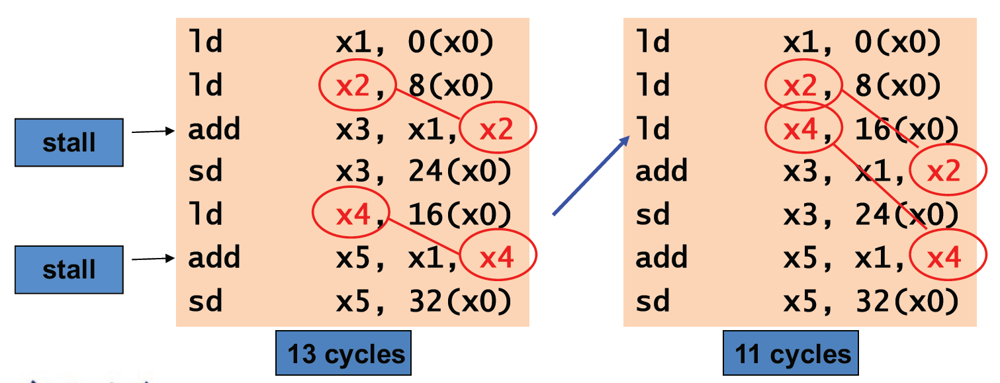

# 知识摘录
## Cheating sheet
- booth 算法
- 乘除法器的流程（移位与赋值的顺序）
- 拓展的操作（`rem`,`div`）
- 规格化的特殊表示
- NaN以及无穷：[传送门](https://note.noughtq.top/system/co/3#ieee-754-floating-point-standard)
- hazard的判断条件；
```verilog
// EX hazard
if (EX/MEM.RegWrite and (EX/MEM.RegisterRd != 0)
    and (EX/MEM.RegisterRd == ID/EX.RegisterRs1))
        ForwardA = 10

if (EX/MEM.RegWrite and (EX/MEM.RegisterRd != 0)
    and (EX/MEM.RegisterRd == ID/EX.RegisterRs2))
        ForwardB = 10

// MEM hazard
if (MEM/WB.RegWrite and (MEM/WB.RegisterRd != 0)
    and not(EX/MEM.RegWrite and (EX/MEM.RegisterRd != 0)
        and (EX/MEM.RegisterRd == ID/EX.RegisterRs1))
    and (MEM/WB.RegisterRd == ID/EX.RegisterRs1))
        ForwardA = 01

if (MEM/WB.RegWrite and (MEM/WB.RegisterRd != 0)
    and not(EX/MEM.RegWrite and (EX/MEM.RegisterRd != 0)
        and (EX/MEM.RegisterRd == ID/EX.RegisterRs2))
    and (MEM/WB.RegisterRd == ID/EX.RegisterRs2))
        ForwardB = 01
```

- 中断和异常


## Chapter 2
### C->RISC-V
#### 索引 vs 指针的访问
```c
void clear1(long long int array[], size_t int size) {
    size_t i;
    for (i = 0; i < size; i++)
        array[i] = 0;
}

void clear2(long long int *array, size_t int size) {
    long long int *p;
    for (p = array; p < &array[size]; p++) 
        *p = 0;
}
```
对应的汇编代码：
```c
    li   x5, 0            // i = 0
loop1:                    
    slli x6, x5, 3        // x6 = i * 8
    add  x7, x10, x6      // x7 = address of array[i]
    sd   x0, 0(x7)        // array[i] = 0
    addi x5, x5, 1        // i++
    blt  x5, x11, loop1   // if (i < size) go to loop1
```
> 索引访问，每次重新通过`i`的自增与移位重新计算访问的地址；

```c
    mv   x5, x10          // p = address of array[0]
    slli x6, x11, 3       // x6 = size * 8
    add  x7, x10, x6      // x7 = address of array[size]
loop2:                    
    sd   x0, 0(x5)        // Memory[p] = 0
    addi x5, x5, 8        // p += 8
    bltu x5, x7, loop2    // if (p < &array[size]) go to loop2
```
> 指针访问，指针每次都指向下一个元素的地址，通过指针的自增与移位来访问元素；


## Chapter  3
**溢出**：关注是否存在逻辑上的谬误
- 发生在符号数的加减法运算过程当中；
- 加法：正数相加变成负数，或者负数相加变成正数；
- 减法：同理，正数减负数理应为正数，如果结果为负数则溢出；负数减正数理应为负数，如果结果为正数则溢出；
> e.g. 0x12 + 0x78 = 0x8A 发生了溢出，但是没有进位.


**进位**：仅关注符号位的高1位是否得到了进位`1`.

乘法的浮点数运算：指数相加之后 **减去** 偏移量；
> 除法同理，相减之后 **加上** 偏移量.

**round to neareast even**: 
- 只有在`guard round`位为`10`即处于中间状态时才启用；
- 此时检查`sticky`位（如果右侧还有1则为`1`，否则为`0`）；
- 如果`sticky`位为`0`，则舍入到最近的偶数;
- 如果`sticky`位为`1`，**直接进位**；
> 即`100`是采用这一原则的唯一情况!


由于浮点数在计算过程当中存在精度问题，所以 **结合律** 是不成立的！


## Chapter 4
立即数生成单元获得的立即数，需要将其 **符号扩展** 至64位，便于在ALU中参与64位的运算；

k级流水线执行n条指令所需的时钟周期数 **n-1+k**
> 下面是结合 **hazard** 的练习：
> 


多发 multiple issue：复制多个处理器元件，实现在一个时钟周期内发射多条指令。
- 引入 CPI 的倒数IPC(instructions per clock cycle) 作为衡量指标;
- 分类：
  - 静态多发：编译器（软件）决定，将多条指令打包到一起执行，比如add/load；
  - 动态多发：处理器（硬件）决定，**reorder**指令，乱序执行但是 **顺序** commit；

## Chapter 5
### Cache
写命中：
- 写穿(write-through)：在更新高速缓存数据的同时也要更新底层内存对应的数据，这样能始终保证两者的一致性；
- 写回(write-back)：执行写操作仅改变高速缓存内的数据；当高速缓存块要被覆盖时才将原数据写入底层的内存中  
写失效：
  - **dirty bit**为`1`时表示内容与main memory不同，如果踢出cache的话需要先写回到main memeory；
- 写分配(write allocate)：即像读失效一样先把数据块拿到高速缓存里再写入。
  - 写回
- 写围绕(write around)：直接将原本要写的数据接入主存中
  - 写穿

### 3C模型
- 强制失效(compulsory misses)（或称为冷启动失效 (cold-start misses)）：首次访问不存在于高速缓存的数据块（初始化时高速缓存为空，自然就失效了）
- 容量失效(capacity misses)：在**全相联**中，高速缓存无法保存所有数据块，因此可能出现检索已被替代的高速缓存块的情况；
- 冲突失效(conflict/collision misses)：在**组相联**与**直接映射**的置放方案中，可能会遇到多个块在同一个集内竞争的情况

### TLB
translation-lookaside buffer： 用于追踪最近使用过的地址映射的高速缓存
> 由于页表时存储在内存中的，访问耗时比作为cache的TLB要长，因此这种设计可以加速；


## Appendix
### 处理器与I/O设备的通信方式
- **Polling** 轮询：
  - 周期性地检查I/O设备是否有请求；
  - 将会浪费大量的时间，不适合频率较少的I/O设备；
- **Interrupt** 中断：
  - 优点是节省了检查的时间，适合频率较少的I/O设备；
- **DMA** 直接内存访问：
  - 使CPU和I/O设备运行互不干扰；
  - CPU需要向DMA提供相应的信息和控制权利；


### RAID
RAID0: 无冗余;  
RAID1: 镜像，高度的availability;  
RAID3: **parity disk** 存在专门的奇偶检验盘来检验数据是否存在错误：  
- 检验盘$P_i$的数据可直接由其他盘对应位的 **sum mod 2** 得到；
- 对一个盘（small）的read很慢，因为需要读取其他盘并计算检验结果，同时不知道哪个盘有问题；
RAID4：为每个盘都提供了自己的 **error detection**,加速了 small read;  
- 对于small write依旧很慢，奇偶检验盘是独立的，如果一次写的数据分布了于两个盘且它们不在一条row上，就需要对奇偶检验盘先后写两次，这需要等待一个时钟周期；
RAID5： 将奇偶检验位分散到所有盘中（成一条对角线）
- 对于small read/write 都十分友好，但不是所有情况.

